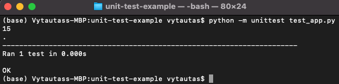

<h1>Machine Learning Operations (MLOps) Notes</h1>
<b>Prepared by Vytautas Bielinskas.</b>

<h2>The MLOps Lifecycle</h2>
<p><ul>
  <li><b>ML development</b> concerns experimenting and developing a robust and reproducible model training procedure (training pipeline code), which consists of multiple tasks from data preparation and transformation to model training and evaluation.</li>
  <li><b>Training operationalization</b> concerns automating thre process of packaging, testing, and deploying repeatable and reliable training pipelines.</li>
  <li><b>Continuous training</b> concerns repeatedly executing the training pipeline in response to the new data or to code changes, or on a schedule, potentially with new training settings.</li>
  <li><b>Model deployment</b> concerns packaging, testing, and deploying a model to a serving environment for online experimentation and production serving.</li>
  <li><b>Prediction serving</b> is about serving the model that is deployed in production for inference.</li>
  <li><b>Continuous monitoring</b> is about monitoring the effectiveness and efficiency of a deployed model.</li>
  <li><b>Data and model management</b> is a central, cross-cutting functon for governing ML artifacts to support audit-ability, traceability, and compliance. Data and model management can also promote shareability, resuability, and discoverability of ML assets</li>
  </ul></p>
  
<h2>MLOps Workflow</h2>
<p>The MLOps Workflow is segmented into two modules:
<ul>
  <li><b>MLOps pipelines</b> (build, deploy, and monitoring) - the upper layer.</li>
  <ul style=list-style-type: circle>
  <li style=square><b>Build</b> pipeline: Data ingestion, Model training, Model testing, Model packaging, Model registering.</li>
    <ul style=list-style-type: circle>
      <li>
      <b>Data ingestion</b>: This step is a trigger step of the ML Pipeline. It deals with the volume, velocity, veracity, and variety of data by extracting data from various data sources and ingesting the required data for the model training step. Robust data pipelines connected to multiple data sources enable it to perform <b>ETL</b> operations to provide necessary data for ML training purposes.
      </li>
      <li>
      <b>Model training</b>: After procuring the required data for ML model training, this step will enable model training. It has modular scripts or code that performs all he traditional steps in ML, such as data pre-processing, feature engineering, and feature scaling before training or retraining any model. <b>Grid Search</b> or <b>Random Search</b> cam be used for automatic hyperparameter tuning.
    </li> 
      <li>
      <b>Model testing</b>: In this tep, we evaluate the trained model performance on a separated set of data points named <b>test data</b> - which was split and versioned in <i>Data ingestion</i> step. The inference of the trained model is evaluated according to selected metrics as per the use case. The output of this step is a report on the trained model's performance.
    </li>  
      <li>
      <b>Model packaging</b>: After trained model has been tested in the previous step, the model can be serialized into a file or containerized (using <i>Docker</i>) to be exported to the production environment.
    </li> 
      <li>
      <b>Model registering</b>: The model that was serialized or containerized is registered and stored in the model registry. A registered model is a logical collection of package of one or more files that assemble, represent, and execute your ML model. For example, multiple files can be registered as one model. For instance, a classification model can be comprised of a vectorizer, model weights, and serialized model files. All these files can be registered as one single model. After registering the model, the model can be downloaded and deployed as needed.
    </li> 
  </ul>
  <li style=square><b>Deploy</b>. The deploy module enables operationalizing the ML models we developed in <i>build</i> stage. Deploy pipeline consist of two major components: <b>Application Testing</b> which transforms into <b>Production Release</b>. Deployment pipeline is enabled by streamlined CI/CD pipelines connecting the development to production environments.</li>
    <ul style=list-style-type: circle>
      <li>
      <b>Application testing</b>: Before deploying an ML model to production, it is vital to test its robustness and performance via testing. So, for this we have <i>Application testing</i> phase where we need to test all the trained models for robustness and performance in a production-like environment alled a <b>test environment</b>. This environment must replicate the production environment.<br>
        The ML model for testing is deployed as an API or streaming service in the test environment to deployment targets such as <b>Kubernetes</b> clusters, container instances, or scalable virtual machines or edge devices as per the need and use case.
      </li>
    </ul>
</ul>  
  <li><b>Drivers</b>: Data, code, artifacts, middleware, and infrastructure - mid and lower layers.</li>
  </p>

<h2>DevOps</h2>
<p>DevOps is a practice that improves a velocity of your team. Main Key Terms of DevOps are listed below.
<ul>
  <li>Continuous Integration.</li>
  <li>Continuous Delivery.</li>
  <li>Microservices (smaller version of an application that is specialized to serve one particular purpose).</li>
  <li>Infrastructure as Code (<i>IaC</i>, defining what your infrastructure will do and checking that into your source control repository).</li>
  <li>Monitoring and Logging.</li>
  <li>Communication and Collaboration.</li>
</ul>
</p>

---

<h2>References</h2>
<ul>
  <li><b>[1] </b><a href="https://services.google.com/fh/files/misc/practitioners_guide_to_mlops_whitepaper.pdf">Google MLOps Whitepapers. </a><i>2021</i>.</li>
  <li><b>[2] </b><a href="https://www.amazon.com/Engineering-MLOps-Rapidly-production-ready-learning/dp/1800562888">Book: Engineering MLOPs. Rapidly build, test, and manage production-ready machine learning life cycles at scale. Written by Emmanuel Raj.</a> <i>2021</i>.</li>
</ul>

<h2>Python Project Structure for MLOps</h2>

<h3>Main commands to set-up project structure</h3>
<p>The whole project structure must be executed in isolated Virtual Environment which can be created in terminal by typing this command:
  
````
python -m venv env_name
````
  
Once you have created you virtual environment, you can activate it with this command:
  
````
source ˜/.env_name/bin/activate
````
  
 Once you have activated your virtual environment, you can check it where the activated Python kernel is located by typing <code>which python</code> in your terminal. The appeared located must match with location of your virtual environment rood directory. The next step is to locate to the directory where <i>requirements.txt</i> is located and install all required dependencies for the project with this command:
  
````
pip install -r requirements.txt
````
  
</p>

<h3>Organizing Project Structure</h3>
<p>
  For MLOps purposes the suggesting Data Science project structure should consists of following files:
  <ul>
    <li><i>Makefile</i>.</li>
    <li><i>requirements.txt</i>.</li>
    <li><i>hello.py</i> - for demonstrating purposes.</li>
    <li><i>test_hello.py</i> - for demonstrating purposes.</li>
    <li><i>virtualenv</i> - (Virtual environment).</li>
  </ul><br>
  This structure must be dominated in any Github repository to be able it deploy, or transfer to any cloud system.</p>
  
  <p>
  Suggesting example of <i>Makefile</i> is represented below.
  
````
install:
    pip install --upgrade pip &&\
        pip install -r requirements.txt

format:
    black *.py

lint:
    pylint --disable=R,C hello.py

test:
    python -m pytest -vv --cov=hello test_hello.py
  
all: install lint test
````

  To construct <i>Makefile</i> always use Tabs, not Spaces. You can use the same <i>Makefile</i> over and over again for the projects.<br>
  If you want to launch specifically <i>lint</i> part, type <code>make lint</code> in your terminal. Alternatively, to launch <i>format</i> part, type <code>make format</code> in your terminal.<br>
  By running <code>make all</code> you can run the whole pipeline in one line.<br>
  Recommended <i>requirements.txt</i> contect is this.

````
pylint
pytest
click
black
pytest-cov
````
  
We do not specify versions of these packages assuming the we will use the newest ones. This list of modules can be extended by adding those ones which are rquired for your case or project.
  
  The example of <i>test_hello.py</i> can be the following code:
  
```` py
from hello import add
  
def test_add()
    assert add(1, 2) == 3
````
</p>

You can define as many test files as you want for usual and extreme use cases.

<h3>Github Actions</h3>
<p>
  In case you want to set-up your github action for your project, click on <i>setup a workflow yourself</i> and you will be re-directed to <i>you_project/.github/workflows/<b>main.yml</b></i>.<br>
  In this file you are telling the system when you push something to the <i>master</i>/<i>main</i> branch, and can be something like this represented below.
  
````
name: Python application test with Github action
on: [push]
jobs:
  build:
    runs-on: ubuntu-latest
    steps:
      - uses: actions/checkout@v2
      - name: Set up Python 3.8
        uses: actions/setup-python@v1
        with:
          python-version: 3.8
      - name: Install dependencies
        run: |
          make install
      - name: Lint with Python
        run: |
          make lint
      - name: Test with Python
        run: |
          make test
      - name: Format code with Python black
        run: |
          make: format
````
  
You can have as many of these files as you want. For every single file that runs, it will exactly do what you say. For example, if we want to later setup a Google based deployment, we can set that up. If we want to set up an Azure based testing project, we can go ahead and set that up. <br>
  You can check the performance of your Github actions by clicking on <b>Actions</b> in the top menu on you Github. On the top of that, you can create a special link to your <i>Readme.md</i> file which will dynamically shows-up the status of your selected Github action. For this, choose and click on <i>Create status badge</i> in your Github action window. This is an useful aspect of a SaaS based continuous integration (<i>CI</i>) system.
</p>

<h3>Testing</h3>
<p>
There are following tpyes of tests:
  <ul>
    <li>Unit</li>
    <li>Integration</li>
    <li>Functional</li>
    <li>End-to-End</li>
    <li>Acceptance</li>
    <li>Performance</li>
    <li>Exploratory</li>
    </ul>
</p>

<h3>Get SSH Key</h3>
<p>
  You can create your new SSH key for your new virtual environment by type <code>ssh-keygen -t rsa</code> in your terminal activated within your virtual environment. From here, you can print-out how public key is looks like by typing <code>cat /home/<your_name>/.ssh/id_rsa</code>.<br>
  Then go yo your Github account. There go to <i>Settings</i>, then go to <i>SSH and GPG keys</i>, type the new name of the key and paste the public key into <i>Key</i> section (starting with <i>ssh-rsa</i>).
</p>

  <h2>Continuous Delivery and Continuous Integration</h2>
  <h3>What is Continuous Delivery</h3>
  <p>Continuous Delivery (furthermore <i>CD</i>) is a term which means that the code is always in a deployable state, both in term of application software and the infrastructure needed to run the code.</p>
  <p><b>Example.</b> You as the user, you may be developing code on your laptop, and you are checking your code into a source control repository. And you would have the <i>master branch</i> which is the default branch in GitHub be the place where it would be hooked up to a particular environment. When you make the change a build server, and this could be many different types:
<ul>
  <li>Github</li>
  <li>Jenkins</li>
  <li>AWS Code Built</li>
  </ul>
  Here you can <i>lint</i>, <i>deploy</i>, and <i>test</i> your code. And then it looks at the infrastructure as code (<b>IaC</b>) and this could be :
  <ul>
  <li>Terraform</li>
  <li>Cloud Formation</li>
  <li>Other kind of infrastructure...</li>
  </ul></p><p>
  This <b>IaC</b> allows you to dynamically update a new environment or even create one. And that environment will be directly mapped to the branch in your source control. <br>
For example, you could have a <i>development</i> branch. You could have a <i>staging</i> branch, and you could have a <i>production</i> branch. And each one of those situations, those branches could automatically create a parallel environment.<br>
You could push your code into a <i>development</i> branch. And then when you are ready to test a change, that would be something that would go to <i>production</i> later, you can merge it into the <i>staging</i> branch. It will automatically go through <i>lint</i> code, <i>test</i> your code, <i>deploy</i> it to your <i>staging environment</i>, you could then do a very extensive <b>load test</b> to verify that your web application could scale to 100,000 users.<br>
And then after that is done, you say, great, let's go ahead and merge it to <i>production</i> and it could go directly into production. 
  </p>
  
  <p>There are four main parts of a simple Continuous Delivery (CD) project:

<ul>
  <li>Project itself (<i>Flask</i> application, or similar).</li>
  <li><i>app.yaml</i>.</li>
  <li><i>cloudbuild.yaml</i>.</li>
  <li><i>requirements.txt</i>.</li><br>
  The examples of these files are represented below:
  
  > <i><b>app.yaml</b></i>. Holds <i>Google App Engine</i> (or similar) configuration data.
  
  ````
  runtime: python38
  ````
  
  > <i><b>cloudbuild.yaml</b></i>. Holds the <i>Google Cloud Build</i> (or similar) deployment configuration.
  
````
steps:
- name: "gcr.io/cloud-builders/gcloud"
  args: ["app", "deploy"]
timeout: "1600s"
````
  
   > <i><b>requirements.txt</b></i>. Hold the package information for the project.
  
  ````
  flask
  ````
  
  > <i><b>app.py</b></i>. Flask application source code.
  
  ```` py
from flask import Flask
from flask import jsonify
app = Flask(__name__)

@app.route('/')
def hello():
    """Return a friendly HTTP greeting."""
    print("I am inside hello world")
    return 'Hello World! CD'

@app.route('/echo/<name>')
def echo(name):
    print(f"This was placed in the url: new-{name}")
    val = {"new-name": name}
    return jsonify(val)


if __name__ == '__main__':
    app.run(host='127.0.0.1', port=8080, debug=True)
  ````
  
</ul></p>

<h2>Cloud Computing Service Models</h2>

<p>
There are many different types of cloud service models. The most popular of these are described in a list below.
<ul>
  <li><b>SaaS</b> (<i>Software as a Service</i>).<br> A good example of this could be <i>Gmail</i>, where you do not have to host your own web server that handles the mail and provide it to clients. You can sign up for an account and get that service. There are also other formats how <i>SaaS</i> can be look like. And these often take place of things like monitoring. A good example of this could be <i>Splunk</i>, or <i>DataDog</i>, or any other large scale IPO company. They build services so that you do not have to provide those services to your company.</li>
  <li><b>PaaS</b> (<i>Platform as a Service</i>).<br>This is about abstracting away the infrastructure. So the application developer focus on building applications. A good example of this would be <i>Heroku</i> - that's been a really common platform as service that been around long time. Google has <i>GAE</i> (<i>Google App Engine</i>), Amazon itself has <i>Beamstalk</i>. The core idea is that you as a developer decide to pay a little bit more, and cloud provider will manage everything for you. So this is almost like a full service. </li>
  <li><b>IaaS</b> (<i>Infrastructure as a Service</i>).<br>It is one of the most extensive offering that you can get. You can get thinks in a bulk and the cost is very low. Good example of this could be <i>Amazon EC2</i>. You can go through and rent a Virtual Machine (<i>VM</i>). You can even bid on a VM via <i>Spot Instances</i>, and get let's say, 10% of the cost of a typical VM. So with <i>IaaS</i> you as the software engineer, cloud architect, need to go through and spin up VMs, Set-up the Newtworking Layer, but at significant cost savings.</li>
  <li><b>MaaS</b> (<i>Metal as a Service</i>).<br>Provided the ability to spin up and provision machines yourself. So, with <i>MaaS</i> you can physically control options there. A lot of these more suited towards, for example, <i>virtualization</i>. This is a core component of most cloud computing, but there are ways to physically control servers. A good example would be <i>GPU</i>. You may have a very specialized multi-GPU setup for, let's say, Machine Learning or specialized database, and you may want to control that physical hardware.</li>
  <li><b>Serverless</b>.<br>Very similar as <i>PaaS</i>, with one exception: it is really based around a function. Sou you could also call as <i>Serverless <b>FaaS</b></i>, or <i>Function as a Service</i>. A reason of this is a different paradigm of developing software. It is basically about piece of logic. And this piece of logic, you put somewhere in the cloud and you hook it up to an event. Serverless is a way of abstracting the business logic into a unit of work and then applying that, wherever you need. Example: <i>AWS Lambda</i>.</li>
</ul>
</p>

<h2>Cloud Computing Economics</h2>
<h3>Key Points and Definitions</h3>
<ul>
  <li><b>Elasticity</b>.<br>Elasticity is the ability to expand a contract according to the demand. That is mean that, your company has some web servers and if the traffic goes up, you can respond by automatically getting a new VM (or two, or more) and you can respond to that traffic. Likewise, if the traffic goes down, you can put away those VMs and you can make them go into a resource where you do not have to physically purchase it. It is about scaling up and down according to demand.</li>
  <li><b>Availability</b>.<br>Solves the question <i>can you respond to a request? Do you have enough capacity?</i> Response reliability can be described as <i>99.9999</i>, or similar.</li>
  <li><b>Self-service</b><br>A self-service means that you can procure things yourself. You do not need to go through an IT procurement process. You can put a credit card and launch a VM. It is more expensive, but it solves the problem of not needing humans.</li>
  <li><b>Reduced complexity</b>.<br>Because the cloud provider is handling a lot of lower level details like networking or security in a data center, you have less complexity for your company to deal with. It is not mentioned a lot, but very important. It is mean that you are focusing on solving the business problems, and not focusing on deciding is there a security problem in your data center, or is your network under attack by people outside the company. This is one of comparative advantages of why you should use cloud computing.</li>
  <li><b>Total Cost of Ownership (TCO)</b>.<br>Asking to questions: <i>What is the cost for a five year period you are spending on software and IT, and salary versus the cost you are paying by renting these capacity?</i> Often times, it is the case that the total cost of ownership when you are using cloud resources is much lower than your own physical data center.</li>
  <li><b>Operational resilience</b>.<br>Asking the question: <i>Can your company withstand a natural disaster?</i> When you use the cloud, they have so much resilience built in. You get this as part of your relationship with the cloud vendor.</li>
  <li><b>Business agility</b>.<br>It is really easy to lose sight of the fact that your company does a specific thing. It is often not anything to do with infrastracture for computing. By leveraging the growing number of services that come with the cloud providers, you can focus your company on building things quicker and responding to the customer needs.</li></ul></p>
  
  <h2>Python Project Testing</h2>
  <h3>Unit testing</h3>
  <b>Quick introduction into Unit Testing, main keypoints and usage</b>
  <p>In this section we will go cover following steps in domain of <i>Unit testing</i>.
  <ul>
  <li>Write tests</li>
    <li>Setup tests</li>
    <li>Best practices</li>
   </ul><br>
    
If you not currently test your codes then it is definitely something that you are going to learn and start adding it to your projects. I guess a lot of you have heard about testing but might not know exactly what is it.<br>

Testing your code is the most exciting thing to do but there is a reason that most companies and teams require their code to be tested. If you want to take a responsible role on big projects, then you are going to need to know how to test.<br>
    
And reason for that is that it is going to save you a lot of time and headache in your daily working routine.<br>
    
When you write good tests for you code it gives you more confidence that your updates and refactoring do not have any unexpected impact or break your code anyway. <br>
    
For example, if you update a function in your project, those changes may have actually broken several sections of your code even if that function itself is still working. <br>
    
Good unit test will make sure that everything is still working as it should. <br>
    
So in this section I will cover the main principles about built-in unit testing module.<br>

In this example we will work with <i>app.py</i> file, the code is represented below:

```` py
# Function to add numbers
def add(x: int, y: int) -> int:
	return x + y


# Function to substract numbers
def substract(x: int, y: int) -> int:
	return x - y


# Function to multiply numbers
def multiply(x: int, y: int) -> int:
	return x * y


# Function to divide numbers
def divide(x: int, y: int) -> float:
	if (x != 0) and (y != 0): 
		return x / y
	else:
		return 'Error. Numbers must not equal to zero.'
````
    
A lot of of us for the same purpose test their code just by putting <code>print</code> statements and occasionally run the code. For example, just like for this <code>print(add(9, 6))</code> function. You can see that the output as <code>15</code>, and this is looking good. On the other hand, testing you code this way is not easy to automate and it is also hard to maintain. Also for testing a lot of different functions there is no way for us to see at a glance what failed and what succeeded. That is Unit testing comes in. 
  </p>
  
> <h4>Step #1. Create a test module</h4>
> <p>For this I we will create a new Python file with name <i>test_app.py</i>.<br>
> 
> Before writing our test, important to know, that before writing our tests we need to call our file with tests underscore something (<i>test_</i>). So we name our  test file as <i>test_app.py</i>.<br>
	Firsty, we need to import <a href = "https://docs.python.org/3/library/unittest.html"><b>unittest</b></a> module, it is a standard Python library, so no need to install anything. Just type <code>pip install unittest</code>.
> </p><br>

> <h4>Step #2. Import the code as a module which we want to test</h4>
> <p>To make it simply, the actual file <i>app.py</i> is stored in the same directory as <i>test_app.py</i>, so we can simply type <code>import app</code>.</p>

> <h4>Step #3. Create a test class</h4>
> <p>Now we need to create some testing cases for the code we want to test. In order to create these test cases, we need to create a test class that inherit from <code>unittest</code> <code>TestCase</code>. To do this, we first going to create a class, we will call this class as <code>TestCalc()</code>. Inside this class we set the inheritence as an argument <code>unittest.TestCase</code>.</p>

> <h4>Step #4. Create a Class test method</h4>
> <p>Now, we are able to write our first test. To do it, we will write a method. Method must to start with <code>test_</code>. This naming convention is required so that when we run this the system knows which method represent tests.</p>
> <p>First, we can test the <code>add()</code> function. Let’s write del <code>test_add</code>, and as always in OOP programming, the first argument for method need to be <code>self</code>. And now within out method we can write a test. Since we inherited from <code>unittest</code> a <code>TestCase</code>, we have access to all these <a href = "https://docs.python.org/3/library/unittest.html#unittest.TestCase.debug">assert methods</a>.</p>
> <p>We are going to use assert equals to test <code>add()</code> function.<br>We can write is as simple as via the variable <code>result</code>: <code>result = app.add(10, 5)</code>.<br>Then it is a good time to use assert method <code>asertEqual</code> which will check if our <code>result</code> variable matches the conditions, so let's write: <code>self.assertEqual(result, 15)</code>.</p>
> <p>At this phase, we should have this small Python script prepared:</p>

```` py
import unittest
import app


class TestCalc(unittest.TestCase):

	def test_add(self):
		result = calc.add(9, 6)
		self.assertEqual(result, 15)
````
> <h4>Step #5.1. Run our first Unit test (without <code>__main__</code> condition</h4>
> <p>We can run our test by using terminal. Open it and navigate to your project directory, where application and test Python files are stored. If you run your code by typing <i>python test_app.py</i>, look, it return nothing.<br>
> Instead we need to run unit tests as our main module and pass in <code>test_app</code>. We can do that by typing <i>python -m unittest test_app.py</i> The output is represented on the screen below.


> We can see that when we run this, the output comes with the dot (<i>.</i>). It says - <i>one run, one test</i>. And the the bottom it says, that everything passed sucesfully.</p>

> <h4>Step #5.1. Run our first Unit test (more robust way with <code>__main__</code> condition</h4>
> <p>Just come down in our code and we can say: <code>if __name__ == ‘__main__’</code> then within this condition we can just say <code>unittest.main()</code>. Now our Python code for testing should be look like:</p>

```` py
import unittest
import app


class TestCalc(unittest.TestCase):

	def test_add(self):
		result = app.add(9, 6)
		self.assertEqual(result, 15)


if __name__ == '__main__':
	unittest.main()
````
	
> <p>Now and run the test code in simple way: <i>python test_app.py</i>.</p>
